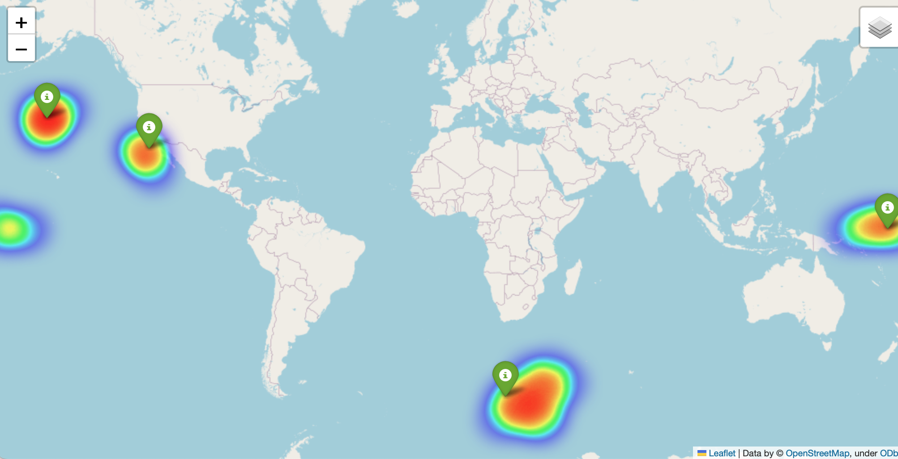

# ARGONE

## Installation and setup
The data and scripts found in this repository can be installed by running
```
git clone https://github.com/Chamberpain/ARGONE.git
```
Or by downloading this package from the link above. 

This will create a directory in whatever folder you were named ARGONE that will contain everything in this repository. I recommend using conda for package management and to create a new environment to run this code. Instruction for how to create a new environment in Conda can be found [here](https://conda.io/projects/conda/en/latest/user-guide/tasks/manage-environments.html#creating-an-environment-with-commands). After activating your new environment, you will need to install some dependencies to run this code. If you are running conda, these dependencies can be installed with the following commands: 
```
conda install ipython 
conda install pandas
conda install scipy   
conda install matplotlib
conda install -c conda-forge geopy
conda install shapely
conda install -c conda-forge folium
```
Alternatively, for installing dependancies using pip:
```
pip install ipython 
pip install pandas
pip install scipy   
pip install matplotlib
pip install geopy
pip install shapely
pip install folium
```
To test your code is working, type in the terminal 
```
python main.py test 150
```
A map of the probability distribution of 4 argo floats should appear. 

## Operation
main.py looks for csv data files in the Data folder of a specified filename. The csv files should have rows equal to the number of floats in your array with the latitude of the float locations recorded in the latitude column and the longitude recorded in the longitude column. An example of a working csv file is shown in test.csv.

The output of the script is a interactive folium map that is found the Output and a csv file that contains the future probality density function of the array. Note that both time and space is descritized to the spatial and temporal resolution of the transition matrix (2 degrees in latitude and longitude and 90 day timesteps). 

The syntax for running the script is 
```
python main.py (filename of csv file) (timestep)
```
for example, in the test case we executed
```
python main.py test 150
``` 
where test.csv is the csv file we want to open and we want to consider a 150 day propogation (the code automatically rounds up to 180 days).
